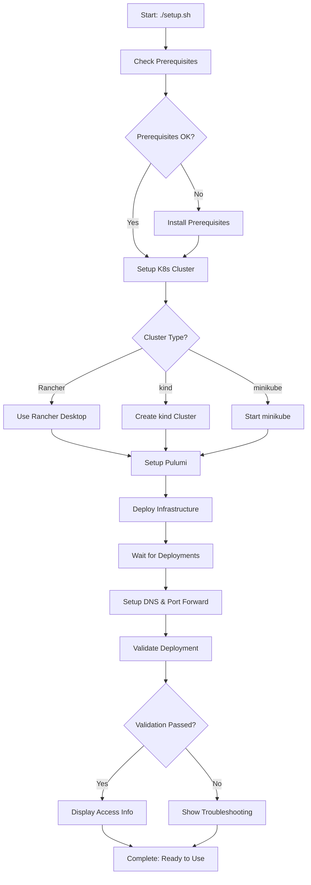

# System Architecture

This document describes the architecture and design decisions for the Keycloak Kubernetes deployment.

## 🏗️ High-Level Architecture

```
┌─────────────────────────────────────────────────────────────────────────────┐
│                                Local Machine                                │
│                                                                             │
│  ┌───────────────────────────────────────────────────────────────────────┐  │
│  │                        Kubernetes Cluster                            │  │
│  │  ┌─────────────────────────────────────────────────────────────────┐ │  │
│  │  │                    keycloak namespace                           │ │  │
│  │  │                                                                 │ │  │
│  │  │  ┌─────────────────┐          ┌─────────────────┐               │ │  │
│  │  │  │   Keycloak      │◄────────►│   PostgreSQL    │               │ │  │
│  │  │  │   Pod:8443      │   DB     │   Pod:5432      │               │ │  │
│  │  │  │  (HTTPS Only)   │ Connection │  (Internal)    │               │ │  │
│  │  │  └─────────────────┘          └─────────────────┘               │ │  │
│  │  │           ▲                              ▲                      │ │  │
│  │  │           │                              │                      │ │  │
│  │  │  ┌─────────────────┐          ┌─────────────────┐               │ │  │
│  │  │  │   Service       │          │   Service       │               │ │  │
│  │  │  │   keycloak:8443 │          │   postgres:5432 │               │ │  │
│  │  │  │  (LoadBalancer) │          │  (ClusterIP)    │               │ │  │
│  │  │  └─────────────────┘          └─────────────────┘               │ │  │
│  │  │           ▲                                                     │ │  │
│  │  │           │                                                     │ │  │
│  │  │  ┌─────────────────────────────────────────────────────────────┐ │ │  │
│  │  │  │                    Secrets                                 │ │ │  │
│  │  │  │  • keycloak-tls (TLS Certificate)                          │ │ │  │
│  │  │  │  • keycloak-db-credentials (DB Auth)                       │ │ │  │
│  │  │  │  • keycloak-admin-credentials (Admin Auth)                 │ │ │  │
│  │  │  └─────────────────────────────────────────────────────────────┘ │ │  │
│  │  │                                                                 │ │  │
│  │  │  ┌─────────────────────────────────────────────────────────────┐ │ │  │
│  │  │  │                Network Policies                            │ │ │  │
│  │  │  │  • Keycloak: Allow 8443 ingress, DB+DNS egress             │ │ │  │
│  │  │  │  • PostgreSQL: Allow Keycloak ingress, DNS egress          │ │ │  │
│  │  │  │  • Default: Deny all other traffic                         │ │ │  │
│  │  │  └─────────────────────────────────────────────────────────────┘ │ │  │
│  │  └─────────────────────────────────────────────────────────────────┘ │  │
│  └───────────────────────────────────────────────────────────────────────┘  │
│                                        ▲                                   │
│                                        │                                   │
│  ┌─────────────────────────────────────┼─────────────────────────────────┐ │
│  │              Host Network           │                                 │ │
│  │                                     │                                 │ │
│  │  Port Forward: kubectl port-forward service/keycloak 8443:8443       │ │
│  │  DNS Entry: /etc/hosts → keycloak.local → 127.0.0.1                  │ │
│  │  Browser Access: https://keycloak.local:8443                          │ │
│  └─────────────────────────────────────────────────────────────────────────┘ │
└─────────────────────────────────────────────────────────────────────────────┘
```

## 🛠️ Component Architecture

### Infrastructure as Code (Pulumi + Go)

```go
┌─────────────────────────────────────────────────────────────────┐
│                        main.go                                  │
├─────────────────────────────────────────────────────────────────┤
│                                                                 │
│  ┌─────────────────┐  ┌─────────────────┐  ┌─────────────────┐  │
│  │   Namespace     │  │    Secrets      │  │   Services      │  │
│  │   Creation      │  │   Generation    │  │   Definition    │  │
│  └─────────────────┘  └─────────────────┘  └─────────────────┘  │
│           │                     │                     │         │
│           └─────────────────────┼─────────────────────┘         │
│                                 │                               │
│  ┌─────────────────┐  ┌─────────┴─────┐  ┌─────────────────┐    │
│  │   PostgreSQL    │  │   Keycloak    │  │ Network Policies│    │
│  │   Deployment    │  │  Deployment   │  │   & Security    │    │
│  └─────────────────┘  └───────────────┘  └─────────────────┘    │
│                                                                 │
└─────────────────────────────────────────────────────────────────┘
```

### Security Architecture

```
┌─────────────────────────────────────────────────────────────────┐
│                       Security Layers                          │
├─────────────────────────────────────────────────────────────────┤
│                                                                 │
│  ┌─────────────────────────────────────────────────────────────┐ │
│  │               Network Security                              │ │
│  │  • NetworkPolicies (ingress/egress rules)                  │ │
│  │  • HTTPS-only communication                                │ │
│  │  • DNS resolution allowed                                  │ │
│  │  • Inter-pod communication restricted                      │ │
│  └─────────────────────────────────────────────────────────────┘ │
│                              │                                 │
│  ┌─────────────────────────────────────────────────────────────┐ │
│  │              Container Security                             │ │
│  │  • Non-root users (keycloak:1000, postgres:999)            │ │
│  │  • Resource limits (CPU/memory)                            │ │
│  │  • Read-only filesystems where possible                    │ │
│  │  • Security contexts applied                               │ │
│  └─────────────────────────────────────────────────────────────┘ │
│                              │                                 │
│  ┌─────────────────────────────────────────────────────────────┐ │
│  │               Data Security                                 │ │
│  │  • Kubernetes Secrets for sensitive data                   │ │
│  │  • TLS encryption in transit                               │ │
│  │  • Database password auto-generation                       │ │
│  │  • Admin credentials auto-generation                       │ │
│  └─────────────────────────────────────────────────────────────┘ │
│                                                                 │
└─────────────────────────────────────────────────────────────────┘
```

## 🚀 Deployment Flow



## 📊 Data Flow

### Authentication Flow

```
┌──────────────┐    ┌──────────────┐    ┌──────────────┐    ┌──────────────┐
│   Browser    │    │   Keycloak   │    │ PostgreSQL   │    │    Client    │
│              │    │              │    │   Database   │    │ Application  │
└───────┬──────┘    └───────┬──────┘    └───────┬──────┘    └───────┬──────┘
        │                   │                   │                   │
        │ 1. Login Request  │                   │                   │
        │──────────────────►│                   │                   │
        │                   │ 2. Verify User    │                   │
        │                   │──────────────────►│                   │
        │                   │ 3. User Data      │                   │
        │                   │◄──────────────────│                   │
        │ 4. Access Token   │                   │                   │
        │◄──────────────────│                   │                   │
        │                   │                   │                   │
        │ 5. API Request with Token             │                   │
        │───────────────────────────────────────────────────────────►│
        │                   │ 6. Token Validation                   │
        │                   │◄──────────────────────────────────────│
        │ 7. Protected Resource                 │                   │
        │◄───────────────────────────────────────────────────────────│
```

### Configuration Management

```
┌─────────────────────────────────────────────────────────────────┐
│                    Configuration Sources                        │
├─────────────────────────────────────────────────────────────────┤
│                                                                 │
│  ┌─────────────────┐  ┌─────────────────┐  ┌─────────────────┐  │
│  │  Pulumi.yaml    │  │   main.go       │  │  Environment    │  │
│  │  (Stack Config) │  │  (Infrastructure│  │   Variables     │  │
│  └─────────────────┘  │   Definition)   │  └─────────────────┘  │
│           │            └─────────────────┘           │         │
│           └─────────────────┼─────────────────────────┘         │
│                             │                                 │
│  ┌─────────────────┐  ┌─────┴─────┐  ┌─────────────────┐      │
│  │ K8s Secrets     │  │ Generated │  │ Runtime Config  │      │
│  │ (Stored)        │  │ Resources │  │ (Keycloak)      │      │
│  └─────────────────┘  └───────────┘  └─────────────────┘      │
│                                                               │
└─────────────────────────────────────────────────────────────────┘
```

## 🔧 Technology Stack

### Core Components

| Component | Technology | Version | Purpose |
|-----------|------------|---------|---------|
| **Container Orchestration** | Kubernetes | 1.28+ | Container management |
| **Identity Provider** | Keycloak | 23.0 | Authentication & authorization |
| **Database** | PostgreSQL | 15-alpine | User data & configuration storage |
| **Infrastructure as Code** | Pulumi | Latest | Resource provisioning |
| **Programming Language** | Go | 1.21+ | IaC implementation |
| **TLS Certificates** | Self-signed | - | HTTPS encryption |
| **Container Runtime** | Docker/containerd | Latest | Container execution |

### Supporting Tools

| Tool | Purpose | Required |
|------|---------|----------|
| **kubectl** | Kubernetes CLI | Yes |
| **kind** | Local K8s cluster | Alternative |
| **minikube** | Local K8s cluster | Alternative |
| **Rancher Desktop** | Local K8s cluster | Preferred |
| **curl** | HTTP testing | Optional |
| **jq** | JSON processing | Optional |

## 🔒 Security Design

### Threat Model

**Assets to Protect:**
- User credentials and personal data
- Authentication tokens
- Admin access to Keycloak
- Database contents
- TLS private keys

**Threat Vectors:**
- Network-based attacks
- Container escape
- Privilege escalation
- Data interception
- Configuration tampering

**Mitigations:**
- Network policies restrict traffic
- Non-root containers
- Resource limits prevent DoS
- TLS encryption in transit
- Secrets managed by Kubernetes

### Security Controls

```
┌─────────────────────────────────────────────────────────────────┐
│                      Security Controls                          │
├─────────────────────────────────────────────────────────────────┤
│                                                                 │
│  Network Layer                                                  │
│  ├── NetworkPolicies: Restrict pod-to-pod communication         │
│  ├── HTTPS Only: No HTTP endpoints exposed                      │
│  └── LoadBalancer: Controlled ingress points                    │
│                                                                 │
│  Container Layer                                                │
│  ├── Security Context: Non-root users, dropped capabilities     │
│  ├── Resource Limits: Prevent resource exhaustion              │
│  ├── Read-only mounts: Where possible                           │
│  └── Minimal images: Alpine-based, fewer attack vectors         │
│                                                                 │
│  Application Layer                                              │
│  ├── Strong passwords: Auto-generated, complex                  │
│  ├── Database encryption: TLS connections                       │
│  ├── Token validation: JWT with proper expiration              │
│  └── Audit logging: Events tracked and logged                   │
│                                                                 │
│  Infrastructure Layer                                           │
│  ├── Secrets management: Kubernetes native secrets             │
│  ├── Certificate rotation: Automated with Pulumi               │
│  ├── Backup strategy: Database dump capabilities                │
│  └── Monitoring: Health checks and alerting                     │
│                                                                 │
└─────────────────────────────────────────────────────────────────┘
```

## 📈 Scalability Considerations

### Current Architecture (Single Instance)
- **Keycloak**: 1 replica
- **PostgreSQL**: 1 replica (single point of failure)
- **Resources**: Moderate CPU/memory allocation
- **Storage**: EmptyDir (ephemeral)

### Production Scaling Path

```
┌─────────────────────────────────────────────────────────────────┐
│                    Production Architecture                      │
├─────────────────────────────────────────────────────────────────┤
│                                                                 │
│  Load Balancer (External)                                       │
│            │                                                    │
│  ┌─────────┼─────────┐                                          │
│  │ Keycloak Cluster │                                           │
│  │ ┌─────┐ ┌─────┐   │                                          │
│  │ │KC-1 │ │KC-2 │   │ (Horizontal scaling)                    │
│  │ └─────┘ └─────┘   │                                          │
│  └─────────┼─────────┘                                          │
│            │                                                    │
│  ┌─────────┼─────────┐                                          │
│  │   Database       │                                           │
│  │ ┌──────────────┐  │                                          │
│  │ │ PostgreSQL   │  │ (High Availability)                     │
│  │ │ Primary +    │  │                                          │
│  │ │ Replicas     │  │                                          │
│  │ └──────────────┘  │                                          │
│  └───────────────────┘                                          │
│                                                                 │
│  Persistent Storage (External)                                  │
│  Monitoring & Logging                                           │
│  External Certificate Authority                                 │
│                                                                 │
└─────────────────────────────────────────────────────────────────┘
```

## 🔄 CI/CD Integration

### GitOps Workflow

```yaml
# Example GitHub Actions workflow
name: Deploy Keycloak
on:
  push:
    branches: [main]

jobs:
  deploy:
    runs-on: ubuntu-latest
    steps:
      - uses: actions/checkout@v4
      - uses: actions/setup-go@v4
        with:
          go-version: '1.21'
      - name: Install Pulumi
        uses: pulumi/action-install-pulumi-cli@v2
      - name: Deploy Infrastructure
        run: |
          pulumi login --local
          pulumi stack select dev --create
          pulumi up --yes
        env:
          PULUMI_ACCESS_TOKEN: ${{ secrets.PULUMI_ACCESS_TOKEN }}
```

## 🔍 Monitoring & Observability

### Health Check Endpoints

```
Keycloak Health:
  └── https://keycloak.local:8443/health

Realm Discovery:
  └── https://keycloak.local:8443/realms/master/.well-known/openid_configuration

Database Health:
  └── kubectl exec deployment/postgres -- pg_isready
```

### Metrics Collection

```
Kubernetes Metrics:
  ├── Pod CPU/Memory usage
  ├── Network I/O statistics  
  ├── Storage utilization
  └── Container restart counts

Application Metrics:
  ├── Authentication success/failure rates
  ├── Token generation/validation latency
  ├── Database connection pool status
  └── Active user sessions
```

## 📋 Operational Procedures

### Backup Strategy

```bash
# Database backup
kubectl exec deployment/postgres -n keycloak -- \
  pg_dump -U keycloak keycloak > backup-$(date +%Y%m%d).sql

# Configuration backup
kubectl get secrets -n keycloak -o yaml > secrets-backup.yaml
pulumi stack export > stack-backup.json
```

### Update Procedures

```bash
# Update Keycloak version
# 1. Update image tag in main.go
# 2. Test in development
# 3. Apply with Pulumi
pulumi up --yes

# Update database
# 1. Backup data first
# 2. Update PostgreSQL image
# 3. Verify data integrity
```

### Disaster Recovery

```bash
# Complete environment restoration
./scripts/cleanup.sh
./setup.sh

# Database restoration
cat backup-$(date +%Y%m%d).sql | \
  kubectl exec -i deployment/postgres -n keycloak -- \
  psql -U keycloak keycloak
```

This architecture provides a solid foundation for both development and production deployments, with clear paths for scaling, monitoring, and maintenance.
